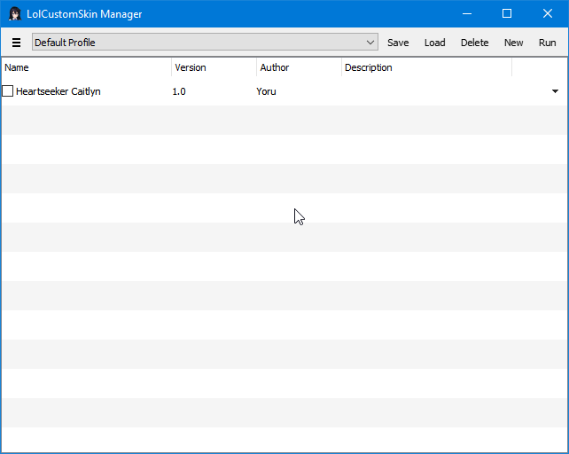
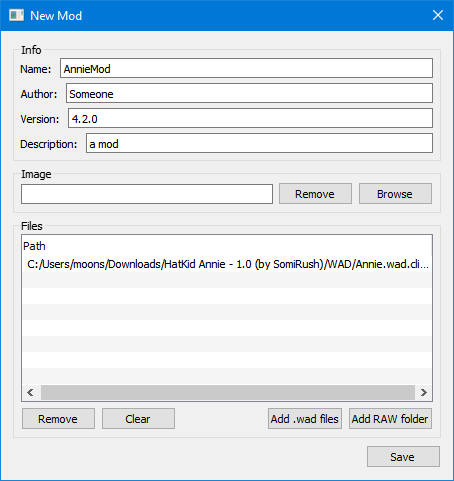
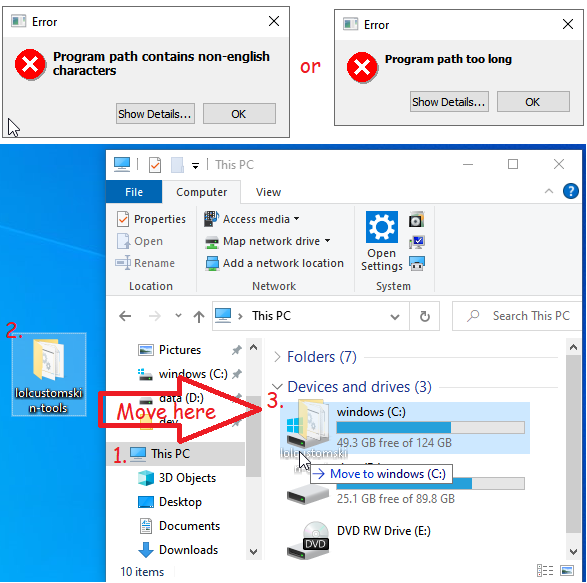

# Download???
 https://github.com/moonshadow565/lolcustomskin-tools/releases

# About CLI tools
 Set of simple CLI tools to help mod league. 

# About lcs-manager.exe
 League of legends mod manager using [Fantome mod format](https://github.com/LoL-Fantome/Fantome/wiki/Mod-File-Format).  
   
   

# Path errors
   

# Help, it still doesn't work...
 Check this instead: https://github.com/LoL-Fantome/Fantome
 
