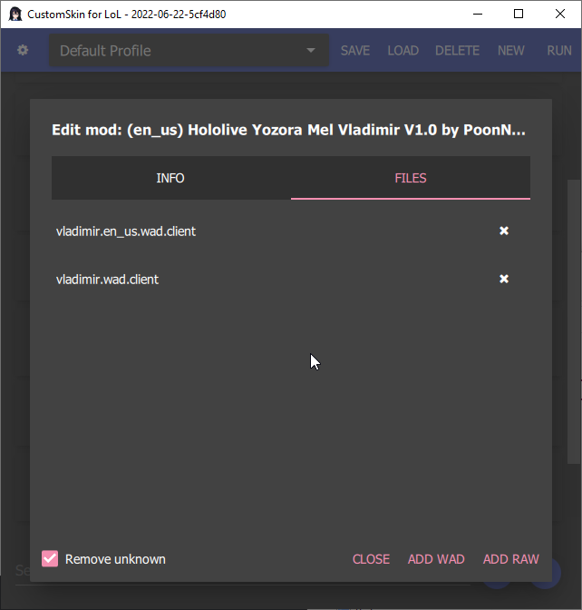

# 🛠️ cslol-manager

> [!WARNING]  
> **Maintenance Mode:** `cslol-manager` is currently in maintenance/deprecation mode. Significant new features and development have shifted to the new **LTK Manager**.  
> 👉 **Check out the future of League modding here: [LeagueToolkit/league-mod](https://github.com/LeagueToolkit/league-mod)**

A modern, high-performance mod manager for League of Legends. Built with C++ and Qt, **cslol-manager** allows you to easily install, manage, and create custom skins and modifications using the [Fantome mod format](https://github.com/LeagueToolkit/Fantome/wiki/Mod-File-Format).

---

## ✨ Features

- **⚡ High Performance:** Built with native C++ for speed and efficiency.
- **📦 Fantome Support:** Full compatibility with the industry-standard `.fantome` mod format.
- **🛠️ Mod Creation Suite:**
  - Create mods from RAW folders.
  - Pack/Unpack `.wad` files.
  - Edit mod metadata and preview images.
- **📂 Profile Management:** Organize your mods into different profiles for quick switching.
- **🔍 Advanced Filtering:** Quickly find and organize your mod collection.
- **🔄 Automatic Updates:** Stay up to date with the latest features and patches.

## 📸 Screenshots

|            Main Window             |             Mod Editing             |           File Management            |
| :--------------------------------: | :---------------------------------: | :----------------------------------: |
|  |  |  |

---

## 🚀 Getting Started

### Prerequisites

- **Windows 10 or 11:** 64-bit operating system is required.
- **League of Legends:** A valid game installation.

### Installation

1.  Navigate to the [latest releases](https://github.com/LeagueToolkit/cslol-manager/releases).
2.  Download the `cslol-manager.exe` (or the zip bundle).
3.  Run the application and point it to your League of Legends game executable.

---

## ⚖️ License & Reuse

The core of **cslol-manager** is open-source under the **GPL-3.0 License**.

### `cslol-dll.dll` Policy

This repository includes `cslol-dll.dll`, the core injection module. Its use and distribution are governed by the [CSLOL DLL License Addendum](LICENSE-CSLOL.md).

If you are a developer looking to reuse this DLL in your own launcher, you must comply with the following:

1.  **Re-signing:** You **cannot** redistribute the DLL with our official signature. You must re-sign it using your own publicly trusted code-signing certificate (e.g., DigiCert, Certum).
2.  **Transparency:** You must publish your certificate's SHA-256 fingerprint and the DLL's SHA-256 hash in your project's documentation or "About" page.
3.  **Anti-Skinhacking:** You **must** implement technical blocks to prevent the use of "Skinhacking" (replicating paid content) and competitive advantage mods.
4.  **No Reverse Engineering:** Patching or tampering with the DLL itself is strictly prohibited.

For full terms, please refer to [LICENSE-CSLOL.md](LICENSE-CSLOL.md).

---

## ⚠️ Disclaimer

- **Use at your own risk:** This software is not endorsed by Riot Games.
- **Server Support:** Officially supports Riot-operated servers. Asian servers and Garena are not officially supported and may experience issues.

---

## 🤝 Contributing

Contributions are welcome! Please feel free to submit a Pull Request or open an issue if you encounter bugs or have feature requests.

---

Developed by the **League Toolkit Organization**.
